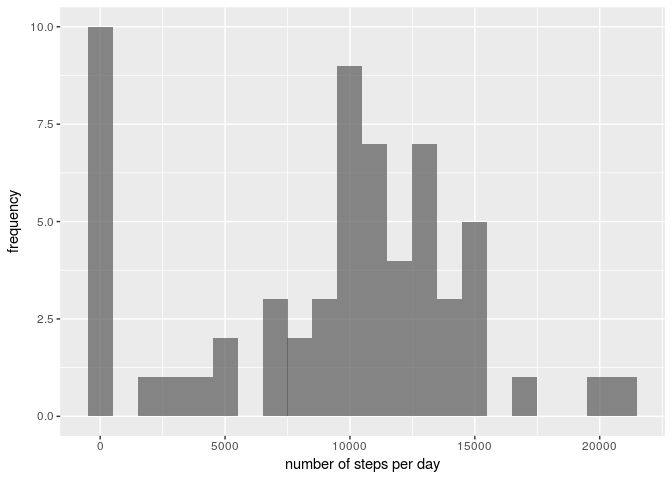

# Reproducible Research: Peer Assessment 1

## Loading and preprocessing the data

### Loading the data
First we load the data from the zip file directly

```r
data<- read.csv(unz('activity.zip','activity.csv'))
```


```r
head(data)
```

```
##   steps       date interval
## 1    NA 2012-10-01        0
## 2    NA 2012-10-01        5
## 3    NA 2012-10-01       10
## 4    NA 2012-10-01       15
## 5    NA 2012-10-01       20
## 6    NA 2012-10-01       25
```

### Transforming the data
We see already that there are lots of missing values for steps. Let's see  what happens also for the other variables

```r
print(paste('The fraction of missing values for steps is ',sum(is.na(data['steps']))/dim(data['steps'])[1]))
```

```
## [1] "The fraction of missing values for steps is  0.131147540983607"
```

```r
print(paste('The fraction of missing values for date is ',sum(is.na(data['date']))/dim(data['date'])[1]))
```

```
## [1] "The fraction of missing values for date is  0"
```

```r
print(paste('The fraction of missing values for interval is ',sum(is.na(data['interval']))/dim(data['interval'])[1]))
```

```
## [1] "The fraction of missing values for interval is  0"
```
So we have lots of missing values for the steps variable. However we should not transform this yet because we will do imputation later. We could convert the dates but there is not much point on doing so yet. I will do it later when needed.

## What is mean total number of steps taken per day?

### Histogram of total number of steps taken per day
We are told that we should ignore missing data for this question. Below we do so and compute the number of steps per day for the days where data is available

```r
data_no_NA <- data[!is.na(data['steps']),]
dates_levels<-levels(data_no_NA[,'date'])
steps_p_day<-data.frame(dates_levels)
counts<-integer(0)
for(day in dates_levels){
  counts<-c(counts,sum(data_no_NA[data_no_NA[,'date']==day,'steps']))
}
steps_p_day['steps_per_day']<-counts
steps_p_day['dates_levels']<-as.Date(steps_p_day[,'dates_levels'])
```
### Histogram of the total number of steps taken each day
Now we make a hstogram for the number of steps per day

```r
library(ggplot2)
ggplot(steps_p_day,aes(steps_per_day))+geom_histogram(alpha = 0.7,binwidth=1000)+ylab('frequency')+xlab('number of steps per day')
```

<!-- -->

### Mean and median of the total number of steps taken per day
Now we compute the mean and median directly and save the results in variables for comparison later.

```r
mean_before_impute<-mean(steps_p_day$steps_per_day)
median_before_impute<-median(steps_p_day$steps_per_day)
print(paste('The mean number of steps per day is',mean_before_impute))
```

```
## [1] "The mean number of steps per day is 9354.22950819672"
```

```r
print(paste('The median number of steps per day is',median_before_impute))
```

```
## [1] "The median number of steps per day is 10395"
```


## What is the average daily activity pattern?

### Time series plot of the average number of steps taken
Here we just have to compute the average number of steps for each interval during the day

```r
interval_levels<-unique(data_no_NA[,'interval'])
avg_steps_series<-data.frame(interval_levels)
avg_steps<-numeric(0)
for(interval in interval_levels){
  avg_steps<-c(avg_steps,mean(data_no_NA[data_no_NA[,'interval']==interval,'steps']))
}
avg_steps_series['avg_steps']<-avg_steps
head(avg_steps_series)
```

```
##   interval_levels avg_steps
## 1               0 1.7169811
## 2               5 0.3396226
## 3              10 0.1320755
## 4              15 0.1509434
## 5              20 0.0754717
## 6              25 2.0943396
```
and now we plot

```r
ggplot(avg_steps_series,aes(interval_levels,avg_steps))+geom_line()+xlab('time of day (seconds)')+ylab('mean number of steps')
```

<!-- -->
### 5-minute interval with maximum number of steps?
Now we obtain the 5 second period that contains the largest number of steps

```r
max_step_interval<-avg_steps_series[avg_steps_series$avg_steps==max(avg_steps_series$avg_steps),'interval_levels']
```
Thus the max step interval is the one at 835 seconds which amounts to 13.9166667 hours after the day started

## Imputing missing values
Now we will impute missing values. 
### Total number of missing values in the dataset 
Let us start by counting

```r
print(paste('The number of missing values for steps is ',sum(is.na(data['steps'])),' out of a total of ',dim(data)[1],' data entries'))
```

```
## [1] "The number of missing values for steps is  2304  out of a total of  17568  data entries"
```

```r
print(paste('The number of missing values for date is ',sum(is.na(data['date']))))
```

```
## [1] "The number of missing values for date is  0"
```

```r
print(paste('The number of missing values for interval is ',sum(is.na(data['interval']))))
```

```
## [1] "The number of missing values for interval is  0"
```
### Strategy for imputing values

From the analysis we did previously, we see that there is a lot of variability in the average number of steps throughout the day, so we should certainly imput according to the time of day. There is also some variability with the time of the year, but that does not look so dramatic (and it might be due to the missing values themselves that appear to be concentrated on certain days). We can check (see following code chunk) that, for the time series we plotted before, all intervals have values available (below is the difference between the number of rows and the number of rows needed if all intervals are present):

```r
length(avg_steps_series$interval_levels/5.)-24*60/5
```

```
## [1] 0
```
So it makes sense to use this data to impute

```r
data_imputed <- data
for(i in 1:(dim(data_imputed)[1])){
  if(is.na(data_imputed[i,'steps'])){
    # note that I round to the nearest integer, because the original data can only be like so.
    location<-avg_steps_series['interval_levels']==data_imputed[i,'interval']
    data_imputed[i,'steps']<-as.integer(round(avg_steps_series[location,'avg_steps'],digits=0))
  }
}
head(data_imputed)
```

```
##   steps       date interval
## 1     2 2012-10-01        0
## 2     0 2012-10-01        5
## 3     0 2012-10-01       10
## 4     0 2012-10-01       15
## 5     0 2012-10-01       20
## 6     2 2012-10-01       25
```
### Imputed dataset

```r
dates_levels<-levels(data_imputed[,'date'])
steps_p_day<-data.frame(dates_levels)
counts<-integer(0)
for(day in dates_levels){
  counts<-c(counts,sum(data_imputed[data_imputed[,'date']==day,'steps']))
}
steps_p_day['steps_per_day']<-counts
steps_p_day['dates_levels']<-as.Date(steps_p_day[,'dates_levels'])
```
###  Histogram, mean and median
Here is the histogram of the total number of steps taken each day

```r
library(ggplot2)
ggplot(steps_p_day,aes(steps_per_day))+geom_histogram(alpha = 0.7,binwidth=1000)+ylab('frequency')+xlab('number of steps per day')
```

<!-- -->
and here is the new mean and median

```r
mean_after_impute<-mean(steps_p_day$steps_per_day)
print(paste('The mean number of steps per day is',mean_after_impute))
```

```
## [1] "The mean number of steps per day is 10765.6393442623"
```

```r
median_after_impute<-median(steps_p_day$steps_per_day)
print(paste('The median number of steps per day is',median_after_impute))
```

```
## [1] "The median number of steps per day is 10762"
```
The relative difference in mean and median after imputation is as follows

```r
print(paste('The variation in mean due to imputation is ',100*(mean_after_impute-mean_before_impute)/mean_before_impute,'%'))
```

```
## [1] "The variation in mean due to imputation is  15.0884670386675 %"
```

```r
print(paste('The variation in median due to imputation is ',100*(median_after_impute-median_before_impute)/median_before_impute,'%'))
```

```
## [1] "The variation in median due to imputation is  3.53054353054353 %"
```
Of course, imputation increasis the total number of daily steps so these differences are expected. The median however, is more stable. Maybe a more realistic imputation strategy would be to use the time series of number of steps using only a few days around the days missing data. 

## Are there differences in activity patterns between weekdays and weekends?

### Dataset with two levels - “weekday” and “weekend”.

```r
temp<-data.frame(weekdays(as.Date(data_imputed[,'date'])))
colnames(temp)<-c('week_period')
levels(temp$week_period)
```

```
## [1] "Friday"    "Monday"    "Saturday"  "Sunday"    "Thursday"  "Tuesday"  
## [7] "Wednesday"
```

```r
levels(temp$week_period)<-c('weekday','weekday','weekend','weekend','weekday','weekday','weekday')
levels(temp$week_period)
```

```
## [1] "weekday" "weekend"
```

```r
data_imputed['week_period']<-temp$week_period
```


###  Panel plot for time series
Now to make the panel plots we make two data frames with the relevant data. 

First for the weekend

```r
interval_levels<-unique(data_imputed[,'interval'])
avg_steps_series_weekend<-data.frame(interval_levels)
avg_steps<-numeric(0)
for(interval in interval_levels){
  avg_steps<-c(avg_steps,mean(data_imputed[data_imputed[,'interval']==interval & data_imputed[,'week_period']=='weekend','steps']))
}
avg_steps_series_weekend['avg_steps']<-avg_steps
avg_steps_series_weekend['week_period']<-rep('weekend',dim(avg_steps_series_weekend)[1])
head(avg_steps_series_weekend)
```

```
##   interval_levels avg_steps week_period
## 1               0      0.25     weekend
## 2               5      0.00     weekend
## 3              10      0.00     weekend
## 4              15      0.00     weekend
## 5              20      0.00     weekend
## 6              25      3.50     weekend
```
Then for weekdays

```r
interval_levels<-unique(data_imputed[,'interval'])
avg_steps_series_weekdays<-data.frame(interval_levels)
avg_steps<-numeric(0)
for(interval in interval_levels){
  avg_steps<-c(avg_steps,mean(data_imputed[data_imputed[,'interval']==interval & data_imputed[,'week_period']=='weekday','steps']))
}
avg_steps_series_weekdays['avg_steps']<-avg_steps
avg_steps_series_weekdays['week_period']<-rep('weekday',dim(avg_steps_series_weekdays)[1])
head(avg_steps_series_weekdays)
```

```
##   interval_levels  avg_steps week_period
## 1               0 2.28888889     weekday
## 2               5 0.40000000     weekday
## 3              10 0.15555556     weekday
## 4              15 0.17777778     weekday
## 5              20 0.08888889     weekday
## 6              25 1.57777778     weekday
```
Now we need to rbind the dataframes

```r
data_panel_plot<-rbind(avg_steps_series_weekdays,avg_steps_series_weekend)
```

Finally we make the panel plot

```r
ggplot(data_panel_plot,aes(interval_levels,avg_steps))+geom_line()+xlab('time of day (seconds)')+ylab('mean number of steps')+facet_wrap(~week_period,nrow=2)
```

<!-- -->
